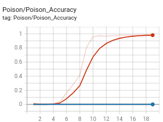

# Defending Against Backdoors with Robust Learning Rate

This is the code for the AAAI 2021 paper [Defending Against Backdoors in Federated Learning with Robust Learning Rate](https://ojs.aaai.org/index.php/AAAI/article/view/17118). 
It has been tested with PyTorch 1.9.0.

To use the code, first get [the datasets](https://utdallas.box.com/s/vjrcfd95oc5trln5byuv92ejq300b373), and unzip them under the root folder.
You can see some example usage in ```src/runner.sh``` and use this script to run your own experiments. For example, the first line says:

```bash
python federated.py --data=fmnist --local_ep=2 --bs=256 --num_agents=10 --rounds=200
```

This runs a federated learning instance with 10 agents for 200 rounds with [Fashion MNIST dataset](https://github.com/zalandoresearch/fashion-mnist), where in each round, local training consists of 2 epochs with a batch size of 256. By default, datasets are distributed uniformly between agents and the aggregation function is [FedAvg](https://arxiv.org/pdf/1602.05629.pdf).

In the second line, we see how agents can carry a backdoor attack:

```bash
python federated.py --data=fmnist --local_ep=2 --bs=256 --num_agents=10 --rounds=200 --num_corrupt=1  --poison_frac=0.5
```

Now, we have a corrupt agent who carries a backdoor attack by poisioning half of his local dataset. The base and target classes for the attack can be specified as argument via ```--base_class (default is 1)``` and ```--target_class (default is 7)```.

Finally, in the third line, we see how we can activate the robust learning rate and try to defend against the attack:

```
python federated.py --data=fmnist --local_ep=2 --bs=256 --num_agents=10 --rounds=200 --num_corrupt=1  --poison_frac=0.5 --robustLR_threshold=4
```
When the argument ```--robustLR_threshold``` is set to a positive value, it activates the defense with the given threshold.

If we look at the training plots, we should see something like the following by round 20.

 

On the left, we see both no attack case (blue), and attack-with-no-defense (red) case has similar performances, and attack-with-RLR (orange) follows them closely for validation accuracy. For the backdoor accuracy however (right), attack-with-no-defense completely fails, where as RLR almost completely elimates the backdoor as evidenced by its accuracy.


Apart from these, one can supply different trojan patterns, use different aggregation functions, and datasets. See ```src/options.py``` and ```src/runner.sh``` for more usage. One thing to note is, when Cifar10 is used, the backdoor pattern is partitioned between the corrupt agents to simulate what's called a [Distributed Backdoor Attack](https://openreview.net/forum?id=rkgyS0VFvr). See ```add_pattern_bd``` method in ```src/utils.py```.


## Citation

```bibtex
@article{Ozdayi_Kantarcioglu_Gel_2021, 
title={Defending against Backdoors in Federated Learning with Robust Learning Rate}, 
volume={35}, url={https://ojs.aaai.org/index.php/AAAI/article/view/17118},  
number={10}, journal={Proceedings of the AAAI Conference on Artificial Intelligence}, 
author={Ozdayi, Mustafa Safa and Kantarcioglu, Murat and Gel, Yulia R.}, 
year={2021}, month={May}, pages={9268-9276}}
```


